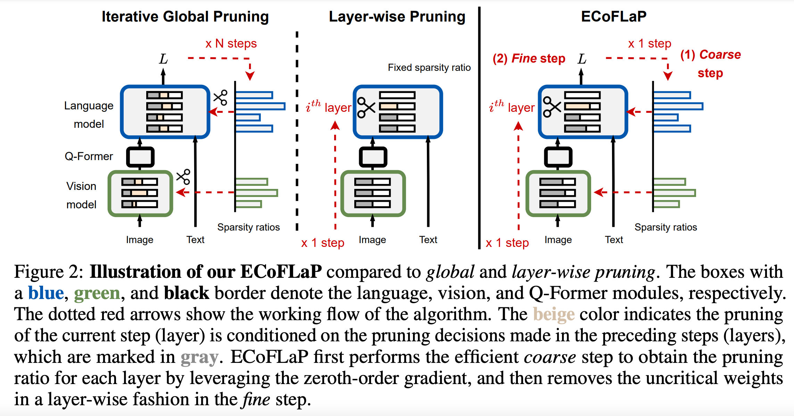

# ECoFLaP: Efficient Coarse-to-Fine Layer-Wise Pruning for Vision-Language Models (ICLR 2024)

* Authors: [Yi-Lin Sung](https://ylsung.github.io/), [Jaehong Yoon](https://jaehong31.github.io/), [Mohit Bansal](https://www.cs.unc.edu/~mbansal/)
* Paper: ["ECoFLaP: Efficient Coarse-to-Fine Layer-Wise Pruning for Vision-Language Models"](https://arxiv.org/abs/2310.02998)
* [Project Page](https://ecoflap.github.io/)

We propose ECoFLaP, a two-stage coarse-to-fine weight pruning approach for Large Vision-Language Models (LVLMs). We first determine the sparsity ratios of different layers or blocks by leveraging the global importance score, which is efficiently computed based on the zeroth-order approximation of the global model gradients. Then, the multimodal model performs local layer-wise unstructured weight pruning based on the given ratios.

We validate our proposed method across various multimodal and unimodal models and datasets, demonstrating significant performance improvements over prevalent pruning techniques in the high-sparsity regime. 



## BLIP-2, FlanT5, ViT experiments

The main code for this part is in `LAVIS/`. Please do everything in LAVIS/ by `cd LAVIS/`.

### Installation

```
pip install -e .
```

### Dataset

Follow the scripts in `lavis/datasets/download_scripts/` to download the datasets.

### BLIP-2 Scripts

```bash
## BLIP-2 experiments

# ECoFLaP - zeroth order
python scripts/blip2/ecoflap_zeroth.py 0 12341

# ECoFLaP - first order
python scripts/blip2/ecoflap_first.py 0 12341

# Wanda
python scripts/blip2/wanda.py 0 12341

# SparseGPT
python scripts/blip2/sparsegpt.py 0 12341
```

### ViT Scripts

```bash
# ECoFLaP - zeroth order
python scripts/eva_clip/ecoflap.py 0 12341

# Wanda
python scripts/eva_clip/wanda.py 0 12341
```

### FlanT5 Scripts

```bash
### Generate the pruned checkpoint

# ECoFLaP - zeroth order
python scripts/t5/ecoflap.py 0 12341

### Do the five-shot evaluation

# go to the mmlu_eval folder
cd ../mmlu_eval

# Make sure to assign pruned_checkpoint to the checkpoint generated in the previous step
bash test.sh 
```

## CLIP experiments

The main code for this part is in `CoOp/`. Please do everything in CoOp/ by `cd CoOp/`.

### Installation

```
pip install -r requirements.txt
```

### Dataset

Follow the scripts in `DATASETS.md` to download the datasets.

### Scripts

```bash
# Wanda and ECoFLaP (w/ Wanda)
bash scripts/coop/ecoflap_wanda.sh

# SparseGPT and ECoFLaP (w/ SparseGPT)
bash scripts/coop/ecoflap_sparsegpt.sh
```


## BLIP experiments to compare with UPop

The main code for this part is in `UPop/`. Please do everything in UPop/ by `cd UPop/`.

### Installation

```
pip install -r requirements.txt
```

### Dataset

Follow the scripts in `README.md` to download the datasets.

### Scripts

```bash
### task=coco, flickr, nlvr2, vqa

# Wanda
bash ecoflap_scripts/${task}/wanda.sh

# ECoFLaP
bash ecoflap_scripts/${task}/ecoflap.sh

# Fine-tune the pruned checkpoint obtained by ECoFLaP
bash ecoflap_scripts/${task}/ecoflap_finetuning.sh
```


## LLaMA experiments

The main code for this part is in `LLaMA/`. Please do everything in LLaMA/ by `cd LLaMA/`.

### Installation

Follow the scripts in `Install.md`.


### Scripts

I removed `--cache_dir` so the program will read the cache that store in `$HF_HOME$` (if specified) or default cache directory.

```bash
# ECoFLaP
bash scripts/ecoflap_zero.sh
```


## Bibtex

```bibtex
@inproceedings{Sung2024ECoFLaP,
    author = {Yi-Lin Sung, Jaehong Yoon, Mohit Bansal},
    title = {ECoFLaP: Efficient Coarse-to-Fine Layer-Wise Pruning for Vision-Language Models},
    booktitle = {International Conference on Learning Representations (ICLR)},
    year = {2024},
}
```